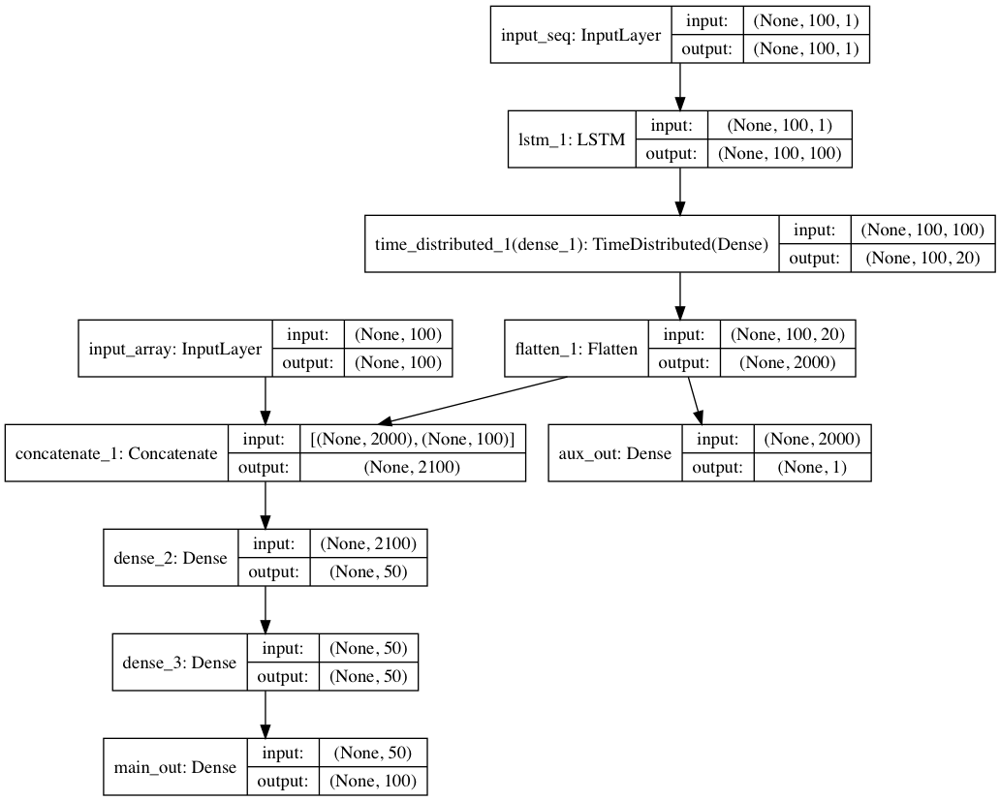
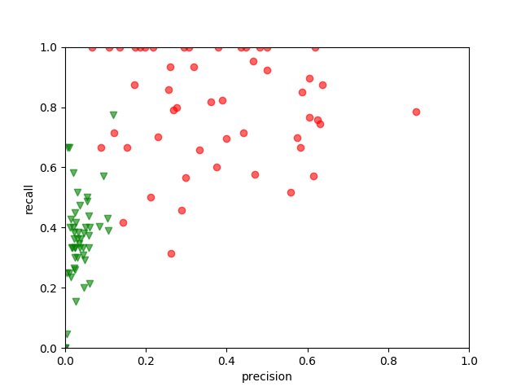

# Detect changes in Internet RTT timeseries with LSTM

The purpose of this project is to design and train an ANN capable of detecting changes in time series, more specifically Internet RTT measurements.

## Design objectifs
At the beginning, online detection was intended.
The sequential input and output behaviour of LSTM would be a wonderful enabler.
The ideal would be delay the output by certain lags/steps compared to the input sequence,
so that the model can leverage the current inputs to tell whether a change happened in the near past.
It is pretty alike the many-to-many layout specified in [this article](http://karpathy.github.io/2015/05/21/rnn-effectiveness/).
However, it doesn't seem easily achievable with keras, accoridng to [this](https://github.com/keras-team/keras/issues/6555).

In order that the model can be compared to [cpt.np](https://cran.r-project.org/web/packages/changepoint.np/index.html) in a fair manner, the main desgin objectif (apart from change detection) is the following:
1. offline detection that digests the entire input sequence.
2. capable of handling input sequence of arbitrary length.

## The resulted model

The above figure outlines the structure of the _model_1_ described in [model.py](model.py).

It has two inputs. __input_seq__ takes the input data in form of sequence, while __input_seq__ take the same data in form of array. The input sequence length is hardcoded to 100.

It has two outputs. __aux_out__ indicates the input sequence experiences at least one change when its value draws close to 1. __main_out__ is of same size as input sequence. It colors each datapoint with 1 and 0. Changepoints can be further deduced from segments of same color. For example, if the __main_out__ gives [0.01, 0.02, 0.01, 0.99, 0.98, 0.99, 0.03, 0.1, 0.02], it indicates changes proabably happen at [3,6].

The detailed data processing procedure can be found in [data.py](data.py).

When using this model to process sequences of varying length, following steps implemented in [changedetectRNN.py](changedetectRNN.py) are taken:
1. if input length is smaller than 100, pad it with its last value; else cut it into chunks of 100 in length;
2. for each chunk sequence, substract max(0, min(chunk));
3. do the detection individually for each chunk;
4. if __aux_out__ indicates change, convert __main_out__ to changepoints;
5. concatenate all changepoints.

## Training
The model is trained against 5000 artificial generated sequences, each of 100 in length. 

The generator can be found [here](https://github.com/WenqinSHAO/rtt_gen). In order to produce relatively short sequences, the [lower bound of the stage length](https://github.com/WenqinSHAO/rtt_gen/blob/bfd6df496a453375ba6460e95206dd48c1012e97/rtt_gen.R#L40) is better changed. 10 instead of 50 is used to generate both the training and validation dataset in this study.

Some stats regarding the training dataset:
1. 3557 out of 5000 sequences ever experienced a change;
2. for sequences experienced changes, in average 39.6% datapoints are expected to be colored to 1.
3. All sequences mixed, 28.1% datapoints are expected to be colored to 1.

The above numbers suggest that the traning data are relatively well balanced.

At the end of 200 epoch, the following result is reached:
```c
loss: 0.3210 - aux_out_loss: 0.0168 - main_out_loss: 0.3193 - val_loss: 0.3420 - val_aux_out_loss: 0.0275 - val_main_out_loss: 0.339
```
binary cross entropy was used for both output.

__aux_out__ is somewhat OK with slight overfitting.
__main_out__ is still far from ideal and dominates the total cost.
The entire learing curve can be found at [cpt_model_1_learning_curve.pdf](cpt_model_1_learning_curve.pdf).

## Validation
The model is first validated against the validation dataset containing as well 5000 sequences of 100 in length. These sequences are generated independant of traning dataset.

Following performance is achieved:
output   | binary cross entropy | binary accuracy
---------|----------------------|----------------
__aux_y__ | 0.031                | 0.994
__main_y__   | 0.348                | 0.800

The total cost is 0.379.

The performance of __aux_y__ is somewhat statisfying, yet there is plenty of room for improvements regarding __main_y__.

Then the model is applied to real RTT timeseries with labels, [real_trace_labelled](real_trace_labelled/). The dataset comes from a [previous project](https://github.com/WenqinSHAO/rtt/tree/master/dataset).
The detection result is compared to [cpt.np](https://cran.r-project.org/web/packages/changepoint.np/index.html) in terms of precision and recall. These two metrics are calcualted on a per sequence base.
Precision is the percentage of detected changepoints that are actually relevant.
Recall tells the percentage of real changepoints that are successfully detected.



Red dots are the results of cpt.np, while green triangles are from our model.
In short, the current model is still far from satisfying compared to the state-of-art method.
Especially in terms of precision. The conversion from segment color to changepoint might have further magnify the errors. Or either, the segment color data representation is questionable.

## Model designe considerations
TODO